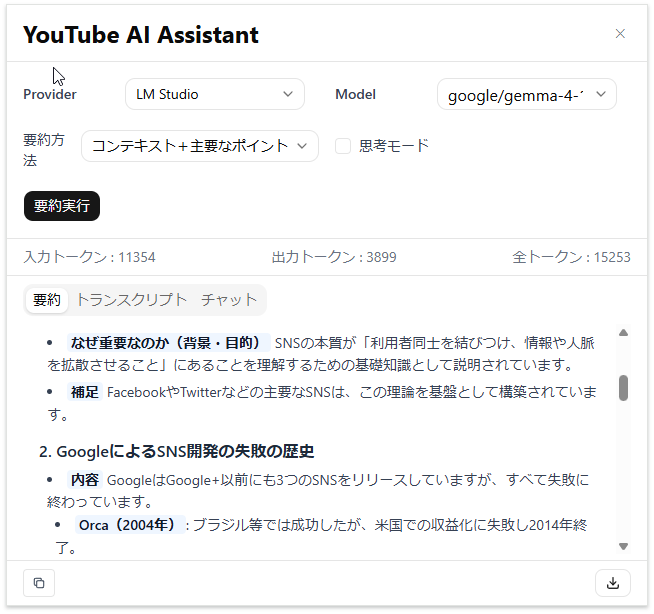
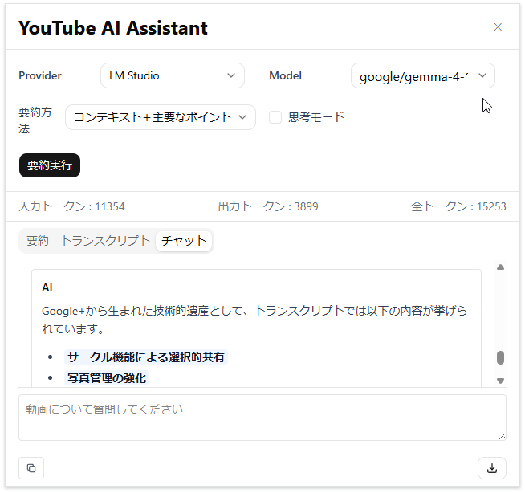

# YouTube AI Summarizer


YouTube 動画のトランスクリプト（字幕データ）を自動取得し、多角的な要約生成や動画内容に関するAIチャットを行える Chrome 拡張機能（Manifest V3）です。

***

## 画面イメージ（サイドパネル）

|                   要約                   |                    チャット機能                   |
| :-----------------------------------------------: | :-----------------------------------------: |
|  |  |

***

## 主な機能

### 1. 動画トランスクリプトの自動取得

* YouTube 動画ページを開くと自動でトランスクリプト（字幕）を取得。

* 細切れの字幕テキストを読みやすい長さにグループ化（マージ）して表示。

* **タイムスタンプジャンプ機能**: タイムスタンプ（例: `01:23`）をクリックすると、YouTube プレイヤーが該当の再生時間へ即座に移動します。

### 2. 選べる 3 タイプの AI 要約（ストリーミング出力対応）

* 動画の内容に合わせて要約タイプを選択可能：

  * **重要ポイント**: 箇条書きで要点のみをコンパクトに抽出。

  * **主要ポイント ＋ コンテキスト**: 文脈や背景を含めて分かりやすくまとめる。

  * **詳細**: 動画全体の流れや詳細な内容を網羅的に出力。
  
* リアルタイム・ストリーミング描画: 生成結果がタイピングのようにリアルタイムかつ滑らかに出力されます。

* 何度でも条件を変えて再生成が可能です。

### 3. 動画に特化した AI チャット

* 字幕データを前提知識として組み込んだコンテキスト認知型 AI チャット。

* 動画の内容について気になった点や詳細な解説を自由に対話・質問可能。

* カーソル追従＆ストリーミング表示: AI の応答がリアルタイムで出力され、テキスト生成に合わせてスレッドが自動的に最適位置へスクロールします。

### 4. 柔軟な LLM プロバイダー & 思考モード設定

* **プロバイダー切替**: OpenAI, Google Gemini, LM Studio (ローカル LLM) 等に対応。

* **モデル選択**: 各プロバイダーが提供する利用可能モデル一覧を動的に取得・選択。

* **思考モード (Thinking)**: 対応モデルにおける思考プロセス (Thinking mode) の ON/Off 切り替えに対応。

### 5. トークン消費量の可視化

* 入力トークン・出力トークン・合計トークン数を動画ごとに集計・リアルタイム表示。

### 6. マークダウン出力・コピー機能

* 表示中のタブ（要約・トランスクリプト・チャット履歴）のデータをプロンプト情報や動画メタデータを含めた綺麗な Markdown フォーマットで出力可能。

  * **コピー**: ワンクリックでクリップボードにコピー（完了時のフィードバック表示付き）。

  * **ダウンロード**: `.md` ファイルとしてローカルに保存。

***

## 技術スタック

* **ビルドツール / プラグイン**: [Vite](https://vitejs.dev/), [@crxjs/vite-plugin](https://crxjs.dev/vite-plugin)

* **UI  / スタイリング**: [React 18](https://react.dev/), [TypeScript](https://www.typescriptlang.org/), [Tailwind CSS](https://tailwindcss.com/), [shadcn/ui](https://ui.shadcn.com/)

* **マークダウンレンダリング**: [react-markdown](https://github.com/remarkjs/react-markdown), [remark-gfm](https://github.com/remarkjs/remark-gfm)

* **アイコン**: [Lucide React](https://lucide.dev/)

* **AI / API 連係**: [Vercel AI SDK](https://sdk.vercel.ai/docs), [youtube-transcript-plus](https://github.com/ericmmartin/youtube-transcript-plus)

* **状態管理**: [Zustand](https://github.com/pmndrs/zustand)

***

---

## API キーの取得

利用したい AI プロバイダーに応じて、あらかじめ API キーを取得してください（ローカル LLM の LM Studio のみを使用する場合は API キーの取得は不要です）。

- **OpenAI API Key**:
  1. [OpenAI API Platform](https://platform.openai.com/) にログイン。
  2. 左メニューの **API Keys** から `Create new secret key` をクリックして生成します。
- **Google Gemini API Key**:
  1. [Google AI Studio](https://aistudio.google.com/) にログイン。
  2. **API キー** 画面で `API キーを作成` をクリックし、新しい API キーを生成します。

---

## 環境変数（.env）の設定

プロジェクトルートに `.env` ファイルを作成し、取得した API キーを設定してください。

```env
# OpenAI
VITE_OPENAI_API_KEY=your_openai_api_key_here
VITE_OPENAI_BASE_URL=https://api.openai.com/v1

# Gemini
VITE_GEMINI_API_KEY=your_gemini_api_key_here
VITE_GEMINI_BASE_URL=https://generativelanguage.googleapis.com/v1beta

# LM Studio (ローカル環境で動作させる場合)
VITE_LMSTUDIO_BASE_URL=http://127.0.0.1:1234/v1
```

## インストール手順

### 開発環境でのビルド

1. **リポジトリのクローン**

```bash
git clone https://github.com/tekku-taro/youtube-ai-summarizer.git
cd youtube-ai-summarizer
```

2. **依存パッケージのインストール**
```bash
npm install
````

3. **環境変数（.env）の作成**
```
# 上述の 環境変数（.env）の設定 を参考に .env ファイルを作成し、API キーを入力します。
```

4. **ビルドの実行**

```bash
npm run build
```

※ プロジェクト直下に `dist` ディレクトリが生成されます。

***

### Chrome への読み込み

1. Google Chrome を開き、アドレスバーに `chrome://extensions/` を入力してアクセスします。
2. 画面右上にある **「デベロッパー モード」** を ON にします。
3. 画面左上に表示される **「パッケージ化されていない拡張機能を読み込む」** ボタンをクリックします。
4. 先ほどビルドして生成された `dist` フォルダを選択してインポートします。
5. Chrome のツールバー（拡張機能アイコン）から **YouTube AI Summarizer** をピン留めします。

***

## 使い方

1. [YouTube](https://www.youtube.com/) にアクセスし、任意の動画ページ（ショート動画は対象外）を開きます。
2. ツールバーの **YouTube AI Summarizer** アイコンをクリックしてサイドパネルを開きます。
3. 設定パネルで利用する AI プロバイダー・モデル・要約タイプを選択します。
4. **「要約」** ボタンを押すと字幕データを元にリアルタイムで要約が生成・描画されます。
5. **「チャット」** タブに切り替えると、動画内容についての質問を自由に対話形式（リアルタイム応答）で投げかけることができます。
6. 画面下部のアクションエリアから、結果を Markdown としてコピー・保存できます。

***

## ライセンス

このプロジェクトは [MIT ライセンス](https://opensource.org/licenses/MIT) のもとで公開されています。

